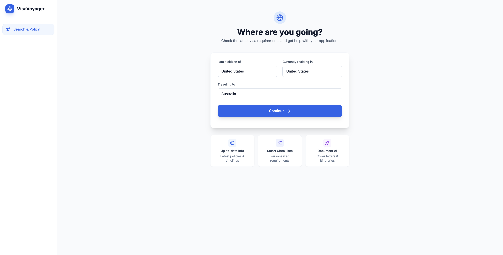
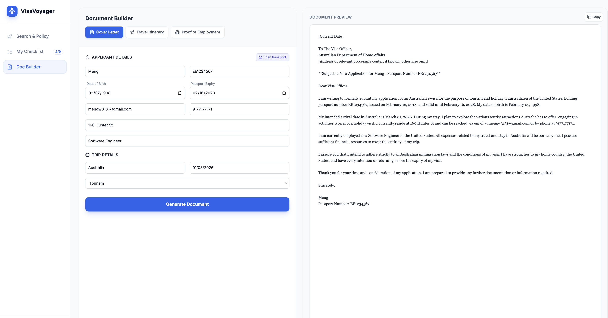

# 🌍 **Visa Voyager**  
### **The Intelligent Vertical Agent for Global Mobility**
<br>

Demo: https://youtu.be/42L3TS4dG2I <br>
Intro Slides: https://docs.google.com/presentation/d/1hL3F3B4veUwS3y23j-Xm_rCG3hwKRLYmPDzXFcVRzwI/edit?slide=id.g3ac655e1153_0_1366#slide=id.g3ac655e1153_0_1366

## 📌 Overview
Visa Voyager is an AI-powered, multi-agent system designed to simplify and streamline the global visa application process.

Every year, tens of millions of visa applications are submitted worldwide (for example, **11.7M+** Schengen visa applications in 2023 alone), with rejection rates around **14–16%** in certain regions.  
Most failures happen not due to ineligibility — but due to **missing documents, wrong photo formats, or inconsistent information**.

Visa Voyager eliminates this friction by providing:

- **Instant, grounded visa requirements**  
- **Personalized checklists** tailored to purpose, residency, and nationality  
- **Automated document generation** (cover letters, itineraries, employer letters)  
- **Client-side privacy**  
- **Passport OCR with Gemini multimodal**  
- **A fully orchestrated, parallel multi-agent architecture**

This is not a chatbot — it is a **vertical intelligent agent** purpose-built for global mobility.

<br>

---

# 🧭 Table of Contents
- [Problem Statement](#-problem-statement)
- [Solution](#-solution)
- [Key Features](#-key-features)
- [Architecture](#-architecture)
- [Multi-Agent System](#-multi-agent-system)
- [Technical Implementation](#-technical-implementation)
- [Screenshots](#-screenshots)
- [Installation & Setup](#-installation--setup)
- [Tech Stack](#-tech-stack)
- [Limitations & Future Work](#-limitations--future-work)
- [License](#-license)

<br>

---

# ❗ Problem Statement

### The Global Mobility Bottleneck
Despite huge advances in travel technology, **visa application remains an outdated, fragmented, and error-prone process**.

Travelers routinely face:

### • **Information Asymmetry**  
Official requirements are scattered across inconsistent embassy websites, PDFs, and third-party blogs. A traveler spends **5–8 hours** researching basic requirements.

### • **High Error Cost**  
A single mistake — wrong photo size, missing booking, mismatched dates — leads to:
- Rejection  
- Lost fees  
- Missed flights  
- Canceled itineraries  

### • **Accessibility Barriers**  
Visa agencies charge **$300–$500+** for basic form-filling that AI can automate.

### • **Privacy Risks**  
Users hesitate to upload passport scans and financial documents to unknown servers.

<br>

---

# 🟢 Solution

### **Visa Voyager — A multi-agent AI system that acts as your private visa consultant.**

It retrieves accurate visa rules, verifies them, creates personalized checklists, generates professional documents, and scans passports — all **within your browser**, preserving privacy.

The system orchestrates multiple specialized agents:

- Legal Consultant  
- Policy Structurer  
- Checklist Builder  
- Document Drafter  
- Vision OCR Agent  
- Auditor (Judge) Agent  
- Orchestrator (Controller)

Travelers receive:

✔ 100% personalized instructions  
✔ Reliable info (grounded with Google Search)  
✔ Embassy-ready documents  
✔ Private, client-side processing  
✔ A guided, error-free workflow  

<br>

---

# ⭐ Key Features

## 🔍 1. Instant Visa Policy Discovery
Enter nationality, residency, destination, and travel purpose →  
Receive a fully grounded summary:

- Visa status (free/required/e-visa/on-arrival)  
- Processing time  
- Mandatory documents  
- Risks and special instructions  
- Source URLs for verification  

---

## 📋 2. Personalized Visa Checklist
The system transforms legal text into:

- Required documents  
- Conditional requirements  
- Interactive completion tracking  

---

## 📝 3. Document Generation Suite
Automatically generates:

- Cover letters  
- Day-by-day itineraries  
- Employer NOC / Verification letters  

Fully personalized using stored user profile (passport data, dates, etc.).

---

## 🪪 4. Passport OCR via Gemini Vision
Upload a passport photo →  
The Vision Agent extracts:

- Name  
- Passport number  
- Nationality  
- Date of birth  
- Expiration date  

Stored **locally** for personalization.

---

## 🔐 5. Privacy by Design
All sensitive PII remains on-device using:

- `localStorage`  
- In-memory session  
- No server round-trips  
- No database storage  

---

## 🤖 6. Multi-Agent Orchestration
A coordinated system of 6+ agents working in:

- Sequence (dependencies)  
- Parallel (performance)  
- Retry loops (self-correction)  

<br>

---

# 🏗 Architecture

### **High-Level System Diagram**

<br>

---

# 🧠 Multi-Agent System

Visa Voyager uses a highly structured multi-agent pattern:

## 1. **Consultant Agent**
- Retrieves visa requirements  
- Uses Gemini + Google Search Grounding  
- Ensures up-to-date info  

## 2. **Policy Structurer Agent**
- Converts messy text → clean JSON  
- Uses `responseSchema` for deterministic output  

## 3. **Checklist Agent**
- Generates task workflows  
- Applies conditional logic  
- Eliminates hallucinated requirements  

## 4. **Drafter Agent**
- Generates legal letters, itineraries, and employer NOC  
- Uses structured system prompts  

## 5. **Vision Agent**
- OCR for passport images  
- Extracts identity fields  

## 6. **Auditor Agent (Judge)**
- Scores output (0–10) on:  
  - Grounding  
  - Completeness  
  - Confidence  
- Triggers automatic Retry-Refine Loop if score < 8  

## 7. **Orchestrator**
- Manages:  
  - State  
  - AgentSessions  
  - Parallel processing  
  - Sequential flow  
  - Error boundaries  

<br>

---

# 🧩 Technical Implementation

Aligned with the Kaggle Agent Intensive capstone requirements:

### ✔ Multi-Agent Design  
Sequential, parallel, and looping agents.

### ✔ Tools & Capacities  
- Google Search  
- Vision multimodal OCR  
- Schema-constrained generation  

### ✔ Sessions & Memory  
- localStorage  
- In-memory session context  
- Context compaction  

### ✔ Evaluation  
- Auditor model scoring  
- Reliability badge displayed in UI  

### ✔ Observability  
- Agent progress logs  
- Structured debug outputs  

<br>

---

# 🖼 Screenshots

### Home Screen


### Visa Policy Results


### Checklist


### Document Builder


<br>

---

# 🚀 Installation & Setup

### 1. Clone the repository
```bash
git clone https://github.com/your-username/visa-voyager.git
cd visa-voyager
```

### 2. Install dependencies
```bash
npm install
```

### 3. Configure environment variables
Create a `.env.local` file in the project root:

```
VITE_GEMINI_API_KEY=REPLACE_ME
```

⚠️ **Do NOT commit API keys.**  
A `.env.example` file is included.

### 4. Start the development server
```bash
npm run dev
```

### 5. Open in your browser
```
http://localhost:5173
```

<br>

---

# 🧱 Tech Stack

- **React + Vite** — UI and client runtime  
- **Gemini 2.5 Flash & Flash-Image** — AI  
- **@google/genai** — Agent sessions, grounding, multimodal  
- **TypeScript** — Safety  
- **LocalStorage** — Client-side profile memory  

<br>

---

# 🚧 Limitations & Future Work

### 1. More Region-Specific Rules  
Support for complex multi-entry and long-stay visas.

### 2. Form Auto-Fill Exports  
Generate embassy-specific PDFs.

### 3. Offline Mode  
Cache high-frequency visa pair results.

### 4. On-Device Vision Pipeline  
Full offline OCR.

### 5. Server-Side Deployment  
Cloud Run or Agent Engine orchestration.

<br>

---

# 📝 License
MIT License — free for personal and commercial use.

